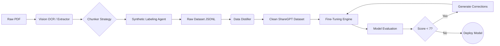

# 🧠 NeuroPipe: Advanced Document-to-LLM Data Engine

[](https://www.python.org/downloads/)
[](https://ollama.com/)
[](https://opensource.org/licenses/MIT)

**NeuroPipe** is an end-to-end autonomous data pipeline designed to transform raw, unstructured documents (PDFs, research papers) into high-quality, instruction-tuned datasets for fine-tuning Large Language Models (LLMs).

> **Why this exists**: Creating high-quality datasets is the bottleneck in training domain-specific AI. This tool automates the "boring stuff"—OCR, chunking, labeling, and cleaning—allowing you to go from PDF to fine-tuned model in hours, not weeks.

---

## 🚀 Key Features

### 1. 👁️ SOTA Vision-LLM OCR
- **No more Garbled Text**: Uses **Moondream** and **Qwen2.5-VL** (Vision-Language Models) to "read" PDFs visually.
- Handles complex double-column layouts, tables, and scientific diagrams that traditional OCR (Tesseract) fails on.
- **Hybrid Fallback**: Automatically switches between PyMuPDF (fast) and Vision OCR (accurate) based on page extractability.

### 2. 🤖 Autonomous Data Labeling
- Uses local LLMs (Granite 4.0, Llama 3) to generate diverse training tasks:
    - **Instruction Tuning**: "How do I treat X using Ayurveda?"
    - **Q&A Pairs**: Fact-based extraction.
    - **Summarization**: TL;DRs of complex sections.
    - **Classification**: Topic tagging.

### 3. 🧪 Data Distillation & Hygiene
- **Self-Cleaning**: The `distill` module removes low-quality generations, duplicates, and confabulations.
- **ShareGPT Formatting**: Automatically converts raw data into the industry-standard conversation format.

### 4. 🎓 Native Fine-Tuning Support
- **One-Command Training**: Built-in training loop using `SFTTrainer` (QLoRA) to fine-tune any HuggingFace model.
- **Multi-Format Support**: Automatically handles ShareGPT, Alpaca, and Raw Text formats.
- **Checkpoint Resume**: Continue training from any checkpoint.
- Optimized for consumer GPUs (supports 4-bit quantization).

### 5. 🧪 Model Evaluation & Self-Improvement *(NEW)*
- **Granite 4 as Judge**: Test your fine-tuned model with automatic quality scoring.
- **Self-Improvement Loop**: Low-scoring responses are corrected and used for next training round.
- **Iterative Enhancement**: Train → Evaluate → Improve → Repeat.

### 6. � Model Deployment *(NEW)*
- **Local Chat**: Interactive terminal testing with your model.
- **Ollama Export**: Convert to GGUF format for Ollama usage.
- **HuggingFace Hub**: Push your model to share with the community.
- **Cloud Deployment**: Docker + Google Cloud Run ready.

---

## �🛠️ Architecture



---

## 📦 Installation

1. **Clone the repository**
   ```bash
   git clone https://github.com/nikhil49023/Data-engine.git
   cd Data-engine
   ```

2. **Install dependencies**
   ```bash
   pip install -r requirements.txt
   ```

3. **Setup Ollama**
   Ensure [Ollama](https://ollama.com) is running and pull the core models:
   ```bash
   ollama pull moondream
   ollama pull granite4
   ```

---

## ⚡ Usage

### 🚀 Interactive Wizard (Recommended)

```bash
python main.py
```

This launches a beautiful CLI wizard with 4 workflows:

| Option | Mode | Description |
|--------|------|-------------|
| 1 | 📄 Dataset Creation | Extract data from PDFs → Generate training datasets |
| 2 | 🧠 Model Training | Fine-tune LLMs on your prepared data |
| 3 | 🧪 Model Evaluation | Test & improve models with Granite 4 |
| 4 | 🚀 Model Deployment | Deploy locally (Ollama) or to cloud |

---

### 📄 Dataset Creation Flow

1. Select input PDF folder and output directory
2. Choose Vision OCR model (Moondream/Qwen)
3. Choose Analyzer model (Granite 4/Llama 3)
4. Pipeline automatically generates:
   - `*_instruction.jsonl` - Instruction tuning data
   - `*_qa.jsonl` - Q&A pairs
   - `*_sharegpt.jsonl` - Chat format (best for training)
   - `*_summarization.jsonl` - Summarization tasks

---

### 🧠 Model Training Flow

**Features:**
- Select from preset models or enter any HuggingFace ID
- Auto-combine multiple datasets from a folder
- HuggingFace login for gated models (Gemma, Llama)
- Resume training from checkpoints
- Optimized hyperparameters for fast training

**Supported Base Models:**
| Model | Size | Best For |
|-------|------|----------|
| sarvamai/sarvam-1 | 2B | Indian Languages |
| google/gemma-2b | 2B | General Purpose |
| TinyLlama/TinyLlama-1.1B | 1.1B | Fast Testing |
| meta-llama/Llama-3.2-1B | 1B | English Tasks |
| Qwen/Qwen2.5-7B | 7B | Complex Reasoning |

**Output:** `models/{model-name}-finetuned/final_adapter/`

---

### 🧪 Model Evaluation Flow

Uses **Granite 4** to evaluate your fine-tuned model:

1. Runs test prompts through your model
2. Scores each response (1-10)
3. Generates improved responses for low scores
4. Creates correction data for next training round

**Self-Improvement Cycle:**
```
Train Model → Evaluate (Granite 4) → Generate Corrections → Retrain → Repeat
```

**Output:** `evaluations/corrections_for_training.jsonl`

---

### 🚀 Model Deployment Flow

| Option | Platform | Description |
|--------|----------|-------------|
| 1 | Local Chat | Interactive terminal chat |
| 2 | Ollama Export | Convert to GGUF format |
| 3 | HuggingFace | Push to HF Hub |
| 4 | Cloud Deploy | Docker + Google Cloud Run |
| 5 | Merge Model | Merge adapter with base |

**API Server:** Creates a ready-to-deploy FastAPI server at `exports/api_server/`

---

### 🖥️ Command Line (Advanced)

```bash
# Process PDFs
python main.py batch "./input_pdfs" --name ayurveda_v1

# Distill & clean
python main.py distill --name ayurveda_v1

# Train model
python main.py train --data datasets/distilled_train.jsonl --model google/gemma-2b
```

---

## 📁 Project Structure

```
Data-engine/
├── main.py                 # CLI entry point & wizards
├── config.yaml             # Configuration settings
├── requirements.txt        # Dependencies
├── src/
│   ├── pipeline.py         # Core data pipeline
│   ├── train.py            # LLM fine-tuning module
│   ├── evaluator.py        # Model evaluation with Granite 4
│   ├── deployer.py         # Deployment utilities
│   ├── distiller.py        # Data cleaning & distillation
│   ├── dataset_generator.py # Dataset format generation
│   └── ollama_client.py    # Ollama API client
├── models/                 # Saved fine-tuned adapters
├── datasets/               # Generated datasets
├── evaluations/            # Evaluation results & corrections
└── exports/                # Deployment artifacts
```

---

## 🔮 Roadmap

- [x] Vision-LLM OCR (Moondream, Qwen)
- [x] Autonomous data labeling
- [x] Multi-format dataset generation
- [x] Native fine-tuning with QLoRA
- [x] Model evaluation with Granite 4
- [x] Self-improvement training loop
- [x] Local & cloud deployment
- [ ] Multi-modal dataset generation (images + text)
- [ ] RAG-based factual verification
- [ ] Web UI dashboard

---

## 🤝 Contributing

Contributions are welcome! Please feel free to submit a Pull Request.

---

## 📄 License

MIT License. Feel free to use and modify.

---

## 👤 Author

**Nikhil** - [GitHub](https://github.com/nikhil49023)

---

*Built with ❤️ for the AI community*
