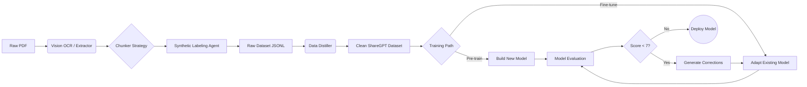

# 🧠 SAARA: Autonomous Document-to-LLM Data Engine

[](https://www.python.org/downloads/)
[](https://ai.google.dev/)
[](https://ai.google.dev/gemma)
[](LICENSE)

> **🏆 Built for Google Gemini Hackathon** - Showcasing the power of Gemini 2.0 Flash and Gemma 2 models in autonomous AI training pipelines.

**SAARA** is an end-to-end autonomous data pipeline designed to transform raw, unstructured documents (PDFs, research papers) into high-quality, instruction-tuned datasets for fine-tuning Large Language Models (LLMs).

> **Why this exists**: Creating high-quality datasets is the bottleneck in training domain-specific AI. This tool automates the "boring stuff"—OCR, chunking, labeling, and cleaning—allowing you to go from PDF to fine-tuned model in hours, not weeks.

---

## 📦 Installation

### As a Python Library (Recommended for programmatic use)

```bash
pip install saara-ai
```

This installs the core package with all data processing, ML training, and RAG capabilities. No CLI dependencies required.

**Use in your Python code:**

```python
from saara import DataPipeline, LLMTrainer, PipelineConfig

# Create configuration
config = PipelineConfig(
    output_directory="./datasets",
    use_ocr=True,
    ocr_model="qwen"
)

# Run pipeline
pipeline = DataPipeline(config)
result = pipeline.process_file("document.pdf", "my_dataset")

# Fine-tune model
trainer = LLMTrainer(config={"output_dir": "./models"})
trainer.train("./datasets/training_data.jsonl")
```

### With Interactive CLI (Optional)

If you want the interactive command-line interface with wizards and beautiful formatting:

```bash
# Install both core package and CLI tools
pip install saara-ai saara-cli

# Or install CLI which automatically installs saara-ai as dependency
pip install saara-cli
```

**Then use the CLI:**

```bash
saara                    # Launch interactive mode
saara version            # Show version
```

---

### Gemini 2.0 Flash - AI Teacher & Evaluator
- **Default Teacher Model**: Uses Gemini 2.0 Flash for autonomous learning
- **Quality Evaluation**: Scores and improves model responses
- **Data Generation**: Creates high-quality training examples
- **Self-Improvement**: Iterative correction loop powered by Gemini

### Gemma 2 - Fine-Tuning Targets  
- **Gemma 2 2B**: Lightweight, CPU-trainable, perfect for domain-specific models
- **Gemma 2 9B**: Production-ready with excellent performance
- **Pre-configured**: Optimized LoRA settings for Gemma architecture
- **First-Class Support**: Gemma models are highlighted and recommended

---

## 🚀 Key Features

### 1. 👁️ SOTA Vision-LLM OCR
- **No more Garbled Text**: Uses **Moondream** and **Qwen2.5-VL** (Vision-Language Models) to "read" PDFs visually.
- Handles complex double-column layouts, tables, and scientific diagrams that traditional OCR (Tesseract) fails on.
- **Hybrid Fallback**: Automatically switches between PyMuPDF (fast) and Vision OCR (accurate) based on page extractability.

### 2. 🤖 Autonomous Data Labeling (Gemini-Powered)
- Uses **Gemini 2.0 Flash** as the default teacher model for:
    - **Instruction Tuning**: "How do I treat X using Ayurveda?"
    - **Q&A Pairs**: Fact-based extraction.
    - **Summarization**: TL;DRs of complex sections.
    - **Classification**: Topic tagging.

### 3. 🧪 Data Distillation & Hygiene
- **Self-Cleaning**: The `distill` module removes low-quality generations, duplicates, and confabulations.
- **ShareGPT Formatting**: Automatically converts raw data into the industry-standard conversation format.

### 4. 🏗️ Pre-training from Scratch
- **Build Your Own LLM**: Create custom models from 15M to 3B parameters.
- **Custom Tokenizers**: Train domain-specific BPE tokenizers on your data.
- **Full Pipeline**: Pre-train → Fine-tune → Evaluate → Deploy.
- Production-ready LLaMA-style architectures.

### 5. 🎓 Native Fine-Tuning Support (Gemma Optimized)
- **Gemma 2 First-Class Support**: Pre-configured LoRA settings for optimal Gemma performance.
- **One-Command Training**: Built-in training loop using `SFTTrainer` (QLoRA).
- **Multi-Format Support**: Automatically handles ShareGPT, Alpaca, and Raw Text formats.
- Optimized for consumer GPUs (supports 4-bit quantization).

### 6. 🧪 Model Evaluation & Self-Improvement (Gemini Judge)
- **Gemini 2.0 as Judge**: Test your fine-tuned model with automatic quality scoring.
- **Self-Improvement Loop**: Low-scoring responses are corrected by Gemini and used for next training round.
- **Iterative Enhancement**: Train → Evaluate → Improve → Repeat.

### 7. 🚀 Model Deployment
- **Local Chat**: Interactive terminal testing with your model.
- **Ollama Export**: Convert to GGUF format for Ollama usage.
- **HuggingFace Hub**: Push your model to share with the community.
- **Cloud Deployment**: Docker + Google Cloud Run ready.

### 8. ⚡ Neural Accelerator *(NEW)*
- **Automatic GPU Optimization**: Detects CUDA/CPU/MPS and configures optimal settings.
- **Mixed Precision Training**: FP16/BF16 for faster training with less memory.
- **Gradient Accumulation**: Train with larger effective batch sizes.
- **Memory Efficient Attention**: Flash Attention / Memory-Efficient SDPA.
- **Smart Recommendations**: Suggests optimal batch size, sequence length based on your GPU.

### 9. 📊 Neural Network Visualizer *(NEW)*
- **Architecture Visualization**: Beautiful console display of model layers.
- **Live Training Dashboard**: Real-time metrics, loss curves, and throughput.
- **HTML Reports**: Generate stunning training reports with Chart.js.
- **Model Analysis**: Inspect any PyTorch model's structure and parameters.

### 10. ☁️ Cloud Runtime *(NEW)*
- **Run on Google Colab**: Full support without Ollama dependency.
- **API-Based Labeling**: Use Gemini, GPT-4, DeepSeek, Groq, or HuggingFace for text processing.
- **Auto-Detection**: Automatically detects Colab, Kaggle, SageMaker, etc.
- **Optimized Settings**: Recommends training parameters based on cloud GPU.

### 11. 🤖 AI-Enhanced Tokenizer *(NEW)*
- **Domain-Aware Vocabulary**: AI extracts medical, legal, code, or scientific terms.
- **Protected Tokens**: Domain terms are never split by BPE.
- **Smart Segmentation**: AI-guided subword merging for semantic coherence.
- **Multi-Domain Support**: Medical, legal, code, scientific, and general domains.
- **Integrated Selection**: Choose tokenizer during training/pretraining wizards.
- **Multiple Providers**: Auto-detect, Ollama, Gemini, OpenAI, or rule-based.

### 12. 🔍 RAG Agent Builder *(NEW)*
- **Build Knowledge Bases**: Index PDFs, text files, and JSONL datasets.
- **Semantic Search**: ChromaDB-powered vector search with sentence-transformers.
- **Interactive Chat**: Query your documents with natural language.
- **Multi-Step Wizard**: Create RAG agents with back navigation and step indicators.
- **REST API Server**: Deploy as an API endpoint for integration.
- **Citation Tracking**: Responses include source references.
- **Multiple Embedding Models**: all-MiniLM-L6-v2, all-mpnet-base-v2, or Ollama embeddings.

---

## 🛠️ Architecture


```mermaid
graph LR
    A[Raw PDF] --> B(Vision OCR / Extractor)
    B --> C{Chunker Strategy}
    C --> D[Synthetic Labeling Agent]
    D --> E[Raw Dataset JSONL]
    E --> F(Data Distiller)
    F --> G[Clean ShareGPT Dataset]
    G --> H{Training Path}
    H -->|Pre-train| I[Build New Model]
    H -->|Fine-tune| J[Adapt Existing Model]
    I --> K[Model Evaluation]
    J --> K
    K --> L{Score < 7?}
    L -->|Yes| M[Generate Corrections]
    M --> J
    L -->|No| N((Deploy Model))
```

---

## 📦 Installation

1.  **Clone the repository**:
    ```bash
    git clone https://github.com/nikhil49023/Data-engine.git
    cd Data-engine
    ```

2.  **Install the CLI**:
    ```bash
    pip install -e .
    ```

3.  **Setup Ollama**:
    - Install [Ollama](https://ollama.ai)
    - The setup wizard will help you install models automatically

### Quick Start

**First-time setup (recommended):**
```bash
saara setup
```

The setup wizard will:
1. ✅ Detect your hardware (GPU, VRAM, RAM)
2. ✅ Recommend optimal models for your system
3. ✅ Install selected vision and analyzer models
4. ✅ Save configuration

---

## ⚡ Usage

### 🎯 Interactive Wizard (Recommended)

```bash
saara run
```

This launches a beautiful CLI wizard with 5 workflows:

| Option | Mode | Description |
|--------|------|-------------|
| 1 | 📄 Dataset Creation | Extract data from PDFs → Generate training datasets |
| 2 | 🧠 Model Training | Fine-tune LLMs on your prepared data |
| 3 | 🧪 Model Evaluation | Test & improve models with Granite 4 |
| 4 | 🚀 Model Deployment | Deploy locally (Ollama) or to cloud |
| 5 | 🏗️ Pre-training | Build & train a model from scratch |

---

### 🏗️ Pre-training from Scratch *(NEW)*

Build your own language model from the ground up:

```bash
saara pretrain
```

**Available Architectures:**

| Name | Parameters | VRAM | Use Case |
|------|-----------|------|----------|
| Nano | ~15M | 2GB+ | Testing, learning (CPU trainable) |
| Micro | ~50M | 4GB+ | Experimentation |
| Mini | ~125M | 6GB+ | Domain-specific pre-training |
| Small | ~350M | 8GB+ | Specialized tasks |
| Base | ~1B | 16GB+ | Production models |
| Large | ~3B | 24GB+ | High-capacity models |

**Pre-training Sub-menu:**
1. 📚 Create Pre-training Dataset
2. 🏗️ Build & Train New Model
3. 🔤 Train Custom Tokenizer
4. 🧪 Test Pre-trained Model
5. 📋 List Pre-trained Models

**Pre-training Dataset Creation:**
- Extracts raw text from PDFs, markdown, and text files
- Cleans OCR artifacts and normalizes unicode
- Chunks text into optimal sizes for language modeling
- **LLM-Enhanced Processing (Optional):**
  - Uses local LLM (Granite 4, Llama 3, Qwen) to clean and improve text
  - Fixes OCR errors and expands abbreviations
  - LLM-based quality scoring for more accurate filtering
- Quality filtering (removes low-quality/incoherent text)
- Deduplication (prevents model memorization)
- Outputs in JSONL format ready for training
- Optional train/validation split

**Workflow:**
```
Create Dataset → Train Tokenizer (optional) → Pre-train Model → Test → Fine-tune → Deploy
```

---


### 📄 Dataset Creation Flow

1. Select input PDF folder and output directory
2. Choose Vision OCR model (Moondream/Qwen) - auto-detects available models
3. Choose Analyzer model (Granite 4/Llama 3/Qwen 2.5/Mistral)
4. Configure advanced options (chunk size, Q&A density)
5. Pipeline automatically generates:
   - `*_instruction.jsonl` - Instruction tuning data
   - `*_qa.jsonl` - Q&A pairs
   - `*_sharegpt.jsonl` - Chat format (best for training)
   - `*_summarization.jsonl` - Summarization tasks

---

### 🧠 Model Training Flow

The training wizard now supports:
- **Gemma 2 Models**: Recommended for best quality-to-cost ratio
- **Custom Pre-trained**: Your own pre-trained models
- **Fine-tuned Adapters**: Continue training existing adapters

**Supported Base Models (Gemma First):**
| Model | Size | Best For |
|-------|------|----------|
| ⭐ google/gemma-2-2b | 2B | **Recommended** - Efficient, CPU-trainable |
| ⭐ google/gemma-2-9b | 9B | Production-ready, high quality |
| google/gemma-2b | 2B | General Purpose |
| google/gemma-7b | 7B | Higher capacity |
| sarvamai/sarvam-1 | 2B | Indian Languages |
| TinyLlama/TinyLlama-1.1B | 1.1B | Fast Testing |

**Output:** `models/{model-name}-finetuned/final_adapter/`

---

### 🧪 Model Evaluation Flow (Gemini-Powered)

Uses **Gemini 2.0 Flash** to evaluate your fine-tuned model:

1. Runs test prompts through your model
2. Scores each response (1-10) using Gemini
3. Generates improved responses for low scores
4. Creates correction data for next training round

**Self-Improvement Cycle:**
```
Train Model → Evaluate (Gemini 2.0) → Generate Corrections → Retrain → Repeat
```

---

### 🚀 Model Deployment Flow

| Option | Platform | Description |
|--------|----------|-------------|
| 1 | Local Chat | Interactive terminal chat |
| 2 | Ollama Export | Convert to GGUF format |
| 3 | HuggingFace | Push to HF Hub |
| 4 | Cloud Deploy | Docker + Google Cloud Run |
| 5 | Merge Model | Merge adapter with base |

---

## 📟 CLI Commands

### Core Commands

| Command | Description |
|---------|-------------|
| `saara run` | Start interactive wizard |
| `saara pretrain` | Build & train model from scratch |
| `saara setup` | First-time hardware detection & model setup |
| `saara version` | Show version information |

### Data Processing

| Command | Description |
|---------|-------------|
| `saara process <file>` | Process a single PDF file |
| `saara batch <dir>` | Process all PDFs in directory |
| `saara distill <input>` | Generate synthetic training data |

### Model Operations

| Command | Description |
|---------|-------------|
| `saara train` | Fine-tune a model (interactive) |
| `saara deploy` | Deploy a trained model |
| `saara evaluate <base> <adapter>` | Evaluate model quality |

### Model Management

| Command | Description |
|---------|-------------|
| `saara models list` | List all available models |
| `saara models install <name>` | Install an Ollama model |
| `saara models remove <name>` | Remove a model |
| `saara models status` | Show hardware & model status |
| `saara models info <name>` | Show detailed model info |
| `saara models storage` | Show disk usage breakdown |
| `saara models clear checkpoints` | Delete all training checkpoints |
| `saara models clear models --yes` | Delete ALL trained models |
| `saara models clear all --yes` | Factory reset (delete everything) |
| `saara models retrain <name>` | Delete & retrain from scratch |

### Accelerator & Visualizer *(NEW)*

| Command | Description |
|---------|-------------|
| `saara accelerator` | Show GPU status & recommended settings |
| `saara visualize` | Visualize neural network architecture |
| `saara visualize --report` | Generate HTML training report |
| `saara benchmark` | Benchmark training performance |

### Cloud Runtime *(NEW)*

| Command | Description |
|---------|-------------|
| `saara cloud info` | Show cloud environment info |
| `saara cloud setup` | Configure cloud API keys |
| `saara cloud quickstart` | Show Colab quickstart guide |

### AI Tokenizer *(NEW)*

| Command | Description |
|---------|-------------|
| `saara tokenizer train` | Train AI-enhanced tokenizer |
| `saara tokenizer train --domain medical` | Train with medical vocabulary |
| `saara tokenizer info -o path/to/tokenizer` | Show tokenizer info |
| `saara tokenizer test -o path/to/tokenizer` | Test tokenization interactively |

### RAG Agent *(NEW)*

| Command | Description |
|---------|-------------|
| `saara rag create <name>` | Create a new knowledge base |
| `saara rag add <kb> <path>` | Add documents to a knowledge base |
| `saara rag chat <kb>` | Interactive chat with knowledge base |
| `saara rag search <kb> "query"` | Search without generation |
| `saara rag list` | List all knowledge bases |
| `saara rag info <kb>` | Show knowledge base details |
| `saara rag serve <kb>` | Start RAG API server |
| `saara rag delete <kb>` | Delete a knowledge base |
| `saara rag clear <kb>` | Clear documents (keep KB) |

### Server

| Command | Description |
|---------|-------------|
| `saara serve` | Start REST API server |

---

## 📁 Project Structure

```
Data-engine/
├── setup.py                # Package setup
├── config.yaml             # Configuration settings
├── requirements.txt        # Dependencies
├── SAARA_Colab.ipynb      # Google Colab notebook (NEW)
├── saara/                  # Source code
│   ├── cli.py             # CLI entry point
│   ├── pipeline.py         # Core data pipeline
│   ├── pretrain.py         # Pre-training module
│   ├── train.py            # LLM fine-tuning module
│   ├── evaluator.py        # Model evaluation
│   ├── deployer.py         # Deployment utilities
│   ├── distiller.py        # Data cleaning
│   ├── model_manager.py    # Ollama model management
│   ├── accelerator.py      # Neural accelerator
│   ├── visualizer.py       # Training visualizer
│   ├── cloud_runtime.py    # Cloud runtime
│   ├── rag_engine.py       # RAG Agent engine (NEW)
│   └── splash.py           # SAARA splash screen
├── models/                 # Saved models (pre-trained & fine-tuned)
├── datasets/               # Generated datasets
├── tokenizers/             # Custom tokenizers
├── knowledge_bases/        # RAG knowledge bases (NEW)
├── evaluations/            # Evaluation results
├── reports/                # Training reports
└── exports/                # Deployment artifacts
```

---

## 🔮 Roadmap

- [x] Vision-LLM OCR (Moondream, Qwen)
- [x] Autonomous data labeling
- [x] Multi-format dataset generation
- [x] Native fine-tuning with QLoRA
- [x] Model evaluation with Granite 4
- [x] Self-improvement training loop
- [x] Local & cloud deployment
- [x] Pre-training from scratch
- [x] Custom tokenizer training
- [x] Iterative adapter fine-tuning
- [x] Neural Accelerator (GPU optimization)
- [x] Training Visualizer (live dashboard, HTML reports)
- [x] Cloud Runtime (Colab/Kaggle support)
- [x] RAG Agent Builder (knowledge bases, semantic search, chat)
- [ ] Multi-modal dataset generation (images + text)
- [ ] Web UI dashboard

---

## 📄 License

**Proprietary License** - Copyright © 2025-2026 Kilani Sai Nikhil. All Rights Reserved.

This software is provided under a proprietary license with the following terms:

✅ **Permitted:**
- Use the software for personal, educational, or commercial purposes
- Reference in academic/educational contexts with attribution

❌ **Not Permitted:**
- Modify, alter, or create derivative works
- Reproduce, copy, or duplicate the software
- Distribute, sublicense, or sell the software
- Reverse engineer or decompile the software

See the [LICENSE](LICENSE) file for full details.

---

## 👤 Author

**Kilani Sai Nikhil** - [GitHub](https://github.com/nikhil49023)

---

*Built with ❤️ for the AI community*
