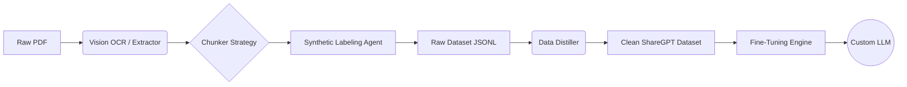

# 🧠 NeuroPipe: Advanced Document-to-LLM Data Engine

[](https://www.python.org/downloads/)
[](https://ollama.com/)
[](https://opensource.org/licenses/MIT)

**NeuroPipe** is an end-to-end autonomous data pipeline designed to transform raw, unstructured documents (PDFs, research papers) into high-quality, instruction-tuned datasets for fine-tuning Large Language Models (LLMs).

> **Why this exists**: creating high-quality datasets is the bottleneck in training domain-specific AI. This tool automates the "boring stuff"—OCR, chunking, labeling, and cleaning—allowing you to go from PDF to fine-tuned model in hours, not weeks.

## 🚀 Key Features

### 1. 👁️ SOTA Vision-LLM OCR
- ***No more Garbled Text***: Uses **Moondream** and **Qwen2.5-VL** (Vision-Language Models) to "read" PDFs visually.
- Handles complex double-column layouts, tables, and scientific diagrams that traditional OCR (Tesseract) fails on.
- **Hybrid Fallback**: Automatically switches between PyMuPDF (fast) and Vision OCR (accurate) based on page extractability.

### 2. 🤖 Autonomous Data Labeling
- Uses local LLMs (Granite 4.0, Llama 3) to generate diverse training tasks:
    - **Instruction Tuning**: "How do I treating X using Ayurveda?"
    - **Q&A Pairs**: Fact-based extraction.
    - **Summarization**: TL;DRs of complex medical sections.
    - **Classification**: Topic tagging.

### 3. 🧪 Data Distillation & Hygiene
- **Self-Cleaning**: The `distill` module looks for low-quality generations, duplicates, and "AI slop" (confabulations).
- **ShareGPT Formatting**: Automatically converts raw data into the industry-standard conversation format used by nearly all training frameworks (Axolotl, Unsloth).

### 4. 🎓 Native Fine-Tuning Support
- **One-Command Training**: Includes a built-in training loop using `SFTTrainer` (QLoRA) to fine-tune models like **Sarvam-1** or **Llama-3** on your newly distilled data.
- Optimized for consumer GPUs (supports 4-bit quantization).

---

## 🛠️ Architecture



## 📦 Installation

1. **Clone the repository**
   ```bash
   git clone https://github.com/yourusername/neuropipe.git
   cd neuropipe
   ```

2. **Install dependencies**
   ```bash
   pip install -r requirements.txt
   ```

3. **Setup Ollama**
   Ensure [Ollama](https://ollama.com) is running and pull the core models:
   ```bash
   ollama pull moondream
   ollama pull granite4
   ```

## ⚡ Usage

### 🚀 Interactive Wizard (Recommended)
The easiest way to use NeuroPipe is via the interactive wizard, which guides you through selecting your data folders, models, and configuration.

```bash
python main.py
```
**Features of the Wizard:**
- **Dynamic Path Selection**: Choose any input folder for your PDFs and any output folder for datasets.
- **Model Selector**: Visual comparison of Vision OCR models (Moondream vs Qwen) and Analyzer models (Granite vs Llama).
- **Format Configuration**: Automatically configures output formats (JSONL, ShareGPT, etc.).

### 🖥️ Command Line (Advanced)

#### 1. Extract & Generate Data
Process a directory of PDFs. This runs OCR, chunking, and synthetic generation.
```bash
python main.py batch "./input_pdfs" --name ayurveda_v1
```

#### 2. Distill & Clean
Filter the raw output into high-quality training splits (train/val).
```bash
python main.py distill --name ayurveda_v1
```

#### 3. Train Model
Fine-tune a model (e.g., Sarvam-1) on your processed data.
```bash
python main.py train --data datasets/distilled_train.jsonl
```

## 🔮 Future Roadmap
- [ ] Multi-modal dataset generation (images + text).
- [ ] RAG-based factual verification web search.
- [ ] Direct export to HuggingFace Hub.

## 📄 License
MIT License. Feel free to use and modify.
